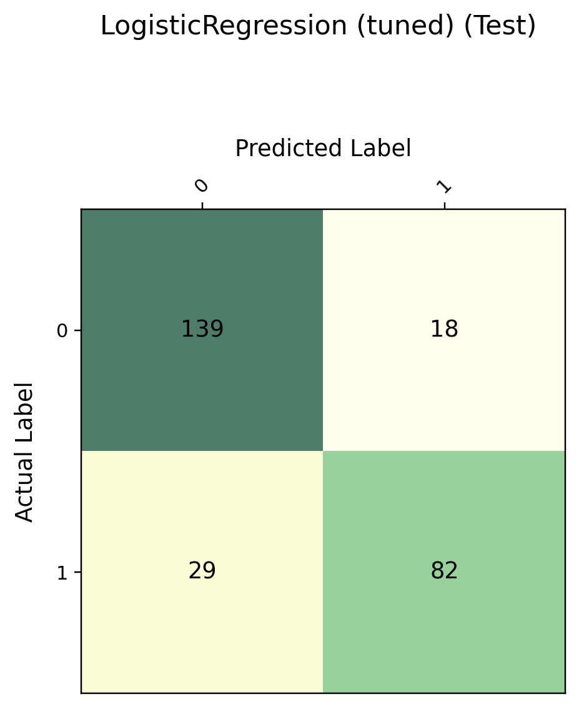
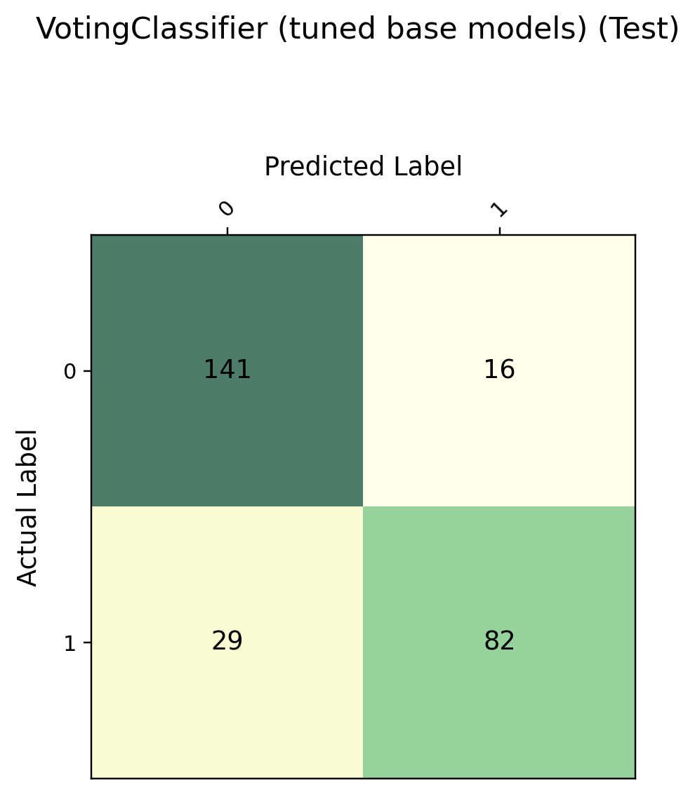

# Titanic-Tabular-ML-Pipeline-GridSearchCV-VotingClassifier-
Using scikit-learn Pipeline and ColumnTransformer to organize the modeling workflow, performing cross-validated hyperparameter tuning (GridSearchCV / RandomizedSearchCV) for LR, SVC, KNN, Decision Tree, and Random Forest, and evaluating an ensemble model via VotingClassifier.

## Key Points

- Data preprocessing / feature engineering (see `Preprocess_Data.py`)
  - Missing values: fill `Age` and `Fare` with the mean
  - Extract `Title` from `Name` (regex) and merge rare categories
  - Create features: `FamilySize`, `is_mother`, age binning
  - One-hot encode categorical features

- Modeling & evaluation (see `model_comparison_voting.py`)
  - `Pipeline` + `ColumnTransformer`: scale numeric columns, passthrough one-hot features
  - Cross-validation with `StratifiedKFold`
  - Hyperparameter search with `GridSearchCV` / `RandomizedSearchCV`
  - Train & compare: Logistic Regression, SVC, KNN, Decision Tree, Random Forest
  - Ensemble with `VotingClassifier` (hard voting)
  - Metrics: accuracy + confusion matrix (test set)

## Project Structure

```text
.
├── data/
|    ├──test.csv
|    └──train.csv
├── Preprocess_Data.py
├── model_pipline_comparison_voting.py
└── assets/
    ├── cm_lr_test.png
    └── cm_voting_test.png
How to Run
1) Install dependencies (example)
pip install numpy pandas scikit-learn matplotlib

2) Run training and evaluation
python model_comparison_voting.py


After running, the test-set confusion matrix images will be saved under assets/ (for README display).

## Visualization Results (Test Confusion Matrices)

A confusion matrix illustrates how predictions are distributed on the test set:

- **Rows (Actual)**: true labels  
- **Columns (Predicted)**: predicted labels  
- **Diagonal cells**: correct predictions  
- **Off-diagonal cells**: misclassifications (false positives / false negatives)


### Logistic Regression (Tuned)

This figure shows the prediction distribution of the tuned Logistic Regression model on the test set.



---

### Voting Ensemble (Hard Voting)

This figure shows the prediction distribution of the hard-voting ensemble on the test set, which is useful for comparing single models with the ensemble approach.




